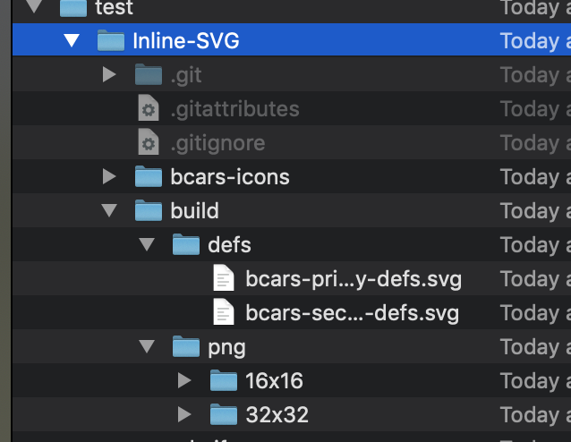

# Booking.com inline SVG icon system 

An inline SVG icon build system powered by NPM and Grunt.  The grunt tasks buil a definition <def> file from a set of svg icon files contained in a folder.  It also generates PNG icons at 16x16 and 32x32 which are used for legacy browser support. 

## Initial setup

1. Install [Node JS](https://nodejs.org/en/) on your computer (if not already installed).  Type `node -v` to check.  If a version is not returned you need to install it.
2. Install Grunt CLI as global: `sudo npm install -g grunt-cli`
3. Navigate to the root folder where you normally store your projects.
4. Open terminal and navigate to your project root folder.  
TIP - I type `cd` in terminal, locate the folder in Finder and drag and drop this folder into terminal.  This adds the full path to the folder so you dont need to type it all in. 
5. Copy & paste this code to clone the build files onto your computer:
 `git clone https://github.com/johnasp/Inline-SVG-system-with-Defs.git`

## Build the icons

1. After you complete step 5 in the instructions above, you will see a new sub-folder callled 'bui-inline-SVG'.  Navigate into this folder by typing `cd bui-inline-svg`
2. Run the icon build process by typing `grunt`

> The process should now run and create a sub-folder called 'build'.  This will contain the definitions SVG file for both the primary and secondary icon sets.  It will also contain a folder called 'png' which contains the PNG fallback files at 16x16 and 32x32 resolutions.  (This can be changed as needed by modifying gruntfile.js accordingly)

  

## How to add a new icon to the set

1. Open Sketch
2. Install the [Sketch SVGO compressor plugin](https://www.sketchapp.com/extensions/plugins/svgo-compressor/) 
3. Create a new artboard and name this accordingly using hyphens where required.  Make the name meaningful and within naming conventions as the name you enter will form the name of the identifier used in the HTML and CSS.
3. Select that artboard then click 'make exportable'. 
4. In export settting select 'SVG' and click the 'export selected' button. The SVGO plugin will automatically clean and compress the SVG output code.
5. If the new is icon is to be part of the primart icon set (which is likely), save it to the following folder _bcars-icons/primary
6. Keep your eye on the terminal window when save the icon file to the path.  You will see the build process kick off automatically as the folder is being 'watched' for any changes.  It will be rebuild all the definition files and PNG folders so they automatically contain the new icon you have just added.

> NB - Ensure the grunt build process is running before performing these steps and the _watch_ process is running.  The purpose of this is to automatically kick off the build whenver a new icon is added or modified.  